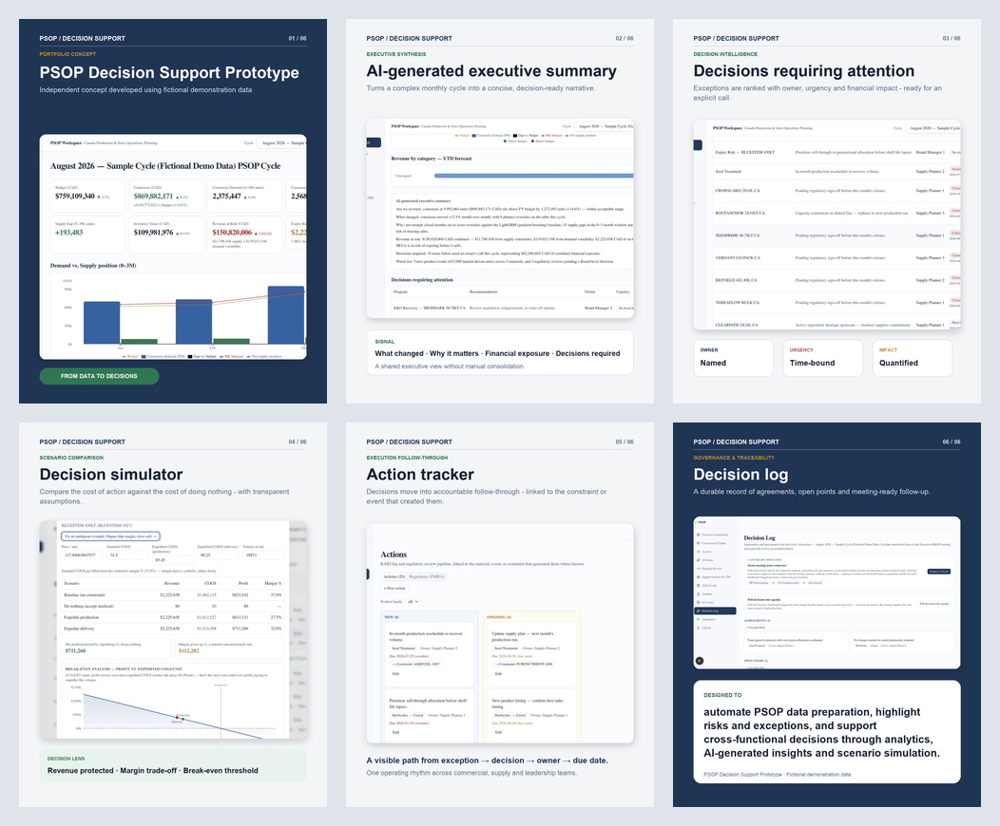

# PSOP Decision Support Prototype

An independent product concept exploring how analytics, AI-generated insights and scenario simulation can support a Production and Sales Operations Planning (PSOP) cycle.

> All names, materials, figures and business scenarios shown in this case are fictional demonstration data.

## Problem

Monthly planning cycles often depend on manual consolidation across commercial, demand, supply and finance teams. Leaders may receive large volumes of information without a clear view of the exceptions that require decisions, their financial impact or the actions that follow.

## Concept

The prototype creates one decision-oriented workflow:

1. **Executive dashboard** - a shared view of demand, supply, inventory and revenue exposure.
2. **AI-generated executive summary** - a concise narrative of what changed, why it matters and what requires attention.
3. **Decision queue** - prioritized exceptions with owner, urgency and quantified financial impact.
4. **Decision simulator** - scenario comparison, protected profit and break-even analysis.
5. **Action tracker** - accountable follow-through linked to the original event or constraint.
6. **Decision log** - a traceable record of agreements and unresolved items.

## Intended value

Designed to automate PSOP data preparation, highlight risks and exceptions, and support cross-functional decisions through analytics, AI-generated insights and scenario simulation.

## Case study

- [View the LinkedIn carousel PDF](PSOP_Decision_Support_Prototype_LinkedIn_Carousel.pdf)
- [View Irina Armasheva's LinkedIn profile](https://www.linkedin.com/in/irina-armasheva/)

## Scope

This repository contains the portfolio case and presentation assets. The production application source code is not included.
